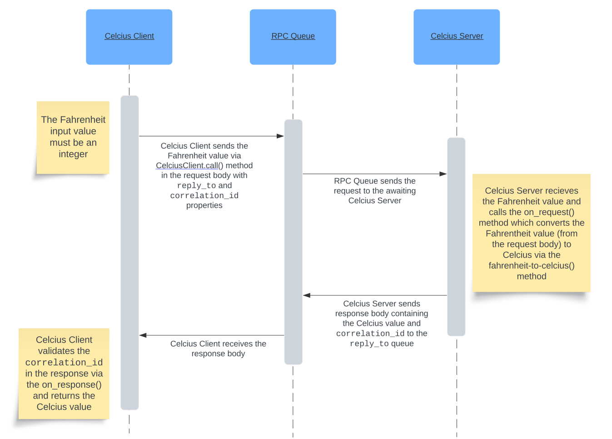

# Fahrenheit to Celcius Converter
---

This microservice converts temperatures from Fahrenheit to Celcius. Use the Client program to request and receive the converted temperature from the Server program.

## How to programmatically REQUEST and RECEIVE data from the microservice

1. Open a terminal and start the Server program by running:

    ```sh
    python celcius_server.py
    ```

2. Open a NEW terminal and start the Client program by running:

    ```sh
    python celcius_client.py
    ```

3. At the prompt in the Client program terminal, enter the temperature in Fahrenheit.

4. Wait for the microservice to return the temperature in Celcius.

## UML sequence diagram showing how requesting and receiving data works

