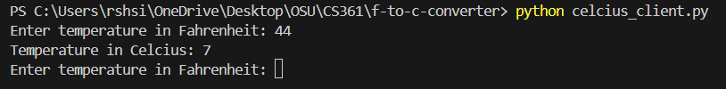

# Fahrenheit to Celcius Converter

This microservice converts temperatures from Fahrenheit to Celcius. Use the Client program to request and receive the converted temperature from the Server program.

## Prerequisites

Before you beging, ensure you have RabbitMQ installed and running locally on localhost standard port (5672). For more informatoin, see the [RabbitMQ documentation](https://www.rabbitmq.com/tutorials/tutorial-one-python#prerequisites).

## How to programmatically REQUEST and RECEIVE data from the microservice

1. Open a terminal and start the Server program by running:

    ```sh
    python celcius_server.py
    ```

2. Open a NEW terminal and start the Client program by running:

    ```sh
    python celcius_client.py
    ```

3. Send a request with Fahrenheit temperature (type: int) to the Server using one of the following options:

    * At the prompt in the Client program terminal, enter the temperature in Fahrenheit.

        

    * Import the `celcius_client.py` into your won program file and use the `call` method to send the request.

        ```py
        # test.py

        import celcius_client

        get_celcius = celcius_client.CelciusClient()

        fahrenheit = 32

        response = get_celcius.call(fahrenheit)
        print("Temperature in Celcius:",str(response))

        ```

4. Wait for the microservice to return the temperature in Celcius.

## UML sequence diagram showing how requesting and receiving data works


